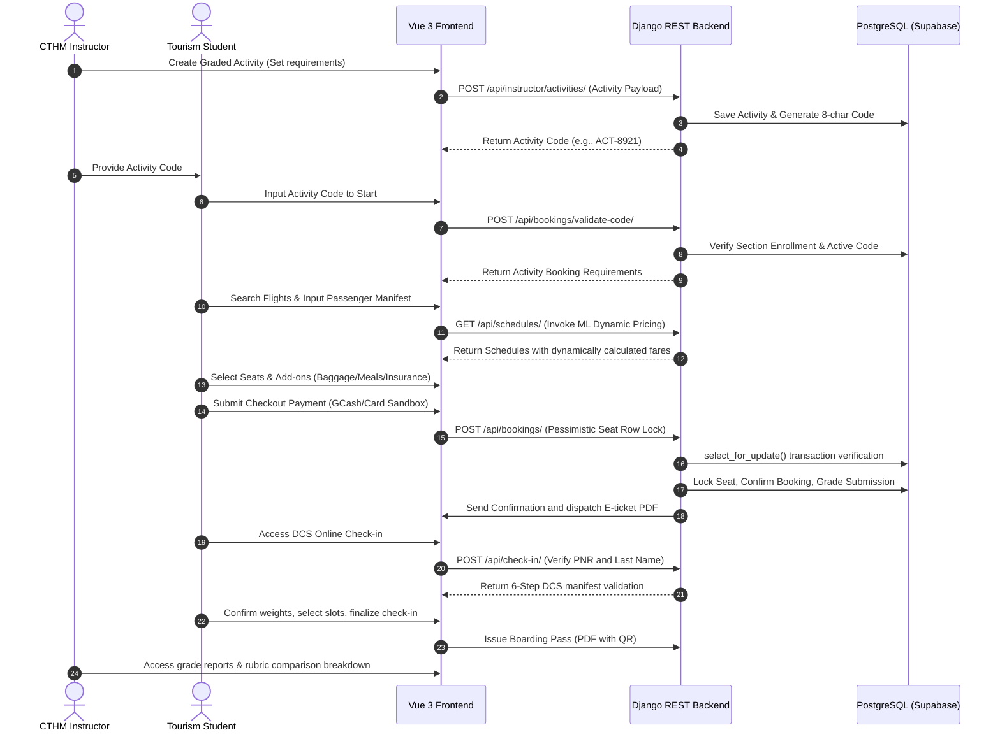

# CHAPTER III: TECHNICAL BACKGROUND

This chapter presents the technical background, architectural framework, development stack, and operational workflows of the "Smart Flight Booking Simulation Platform for CTHM-CSUCC." It details the technical complexities solved, the software and hardware components utilized, and the sequential logic driving the simulation platform.

---

## 3.1 Technicality of the Project

The "Smart Flight Booking Simulation Platform for CTHM-CSUCC" is not merely a static booking web interface; it is a highly decoupled, data-driven, and authoritative educational system. It solves complex software engineering challenges to replicate commercial Passenger Service Systems (PSS) and Departure Control Systems (DCS). The core technical complexities addressed by the platform are detailed below.

### 3.1.1 Decoupled Single-Page Application (SPA) Architectural Paradigm
The project is built on a **Decoupled Single Page Application (SPA)** architecture. The presentation layer (frontend) is fully separated from the business logic and persistence layers (backend), communicating exclusively through asynchronous API boundaries.

```
┌─────────────────────────────────────────────────────────────┐
│                      Vue 3 Frontend                         │
│                    (Presentation Tier)                      │
└──────────────────────────┬──────────────────────────────────┘
                           │ Asynchronous RESTful JSON (Axios)
                           ▼
┌─────────────────────────────────────────────────────────────┐
│                   Django REST Backend                       │
│                     (Application Tier)                      │
└──────────────────────────┬──────────────────────────────────┘
                           │ ORM Queries (PostgreSQL Dialect)
                           ▼
┌─────────────────────────────────────────────────────────────┐
│                   PostgreSQL Database                       │
│                      (Data Tier)                            │
└─────────────────────────────────────────────────────────────┘
```

- **Presentation Tier:** A compiled, static Vue 3 application executing entirely within the client's browser environment.
- **Application Tier:** A Django REST Framework API that exposes stateless endpoints for search, booking, authentication, and grading operations.
- **Integration Boundary:** All communication is performed asynchronously using **Axios**. The frontend implements interceptors that intercept every outgoing HTTP request to inject JSON Web Token (JWT) authorization headers (`Bearer <token>`) and intercept incoming responses to gracefully handle token expiration or API exceptions. This decoupled nature minimizes server load, as the server only delivers serialized data rather than heavy HTML templates.

### 3.1.2 Centralized Reactive State Machine & Session Persistence
Replicating a multi-step airline booking flow (Search → Flight Selection → Passenger Forms → Add-ons → Seat Selection → Review → Payment) requires managing a complex state across various routes. The platform resolves this through a multi-tier state persistence engine:

1. **Centralized Client State (Pinia):** A centralized state management library (`bookingStore.js`) is used as the frontend "single source of truth." It maintains responsive data variables representing selected flights, traveler credentials, seat assignments, and supplementary ancillaries.
2. **Local Dynamic Sync (LocalStorage):** To protect students against browser crashes, network drops, or accidental page refreshes, the Pinia state is dynamically synchronized with the browser's `localStorage` via custom store-subscription middleware.
3. **Session Snapshot Recovery Engine (`snapshotToServer()`):** A background sync engine periodically pushes JSON representations of the student's active booking progress to the backend database. This allows students to pause their activity in the computer lab and resume it from another terminal without losing their progress.

### 3.1.3 Hybrid Predictive-Dynamic Pricing Engine (XGBoost + Business Rules)
To provide students with a realistic industry experience, the platform calculates fares in real time using a two-stage hybrid calculation combining machine learning predictions with rule-based airline business overlays.

```
┌────────────────────────────────────────┐
│  XGBoost Regressor Base Model          │
│  (Historical Flight Dataset Features)  │
└───────────────────┬────────────────────┘
                    │
                    ▼  Predicted Base Fare (P_base)
┌────────────────────────────────────────┐
│  Dynamic Pricing Modifiers             │
│  (Time, Season, Urgency, Occupancy)    │
└───────────────────┬────────────────────┘
                    │
                    ▼  Final Adjusted Fare (P_final)
┌────────────────────────────────────────┐
│  Psychological Rounding Algorithm      │
│  (Fares end in "99" e.g., ₱2,499.00)   │
└───────────────────┬────────────────────┘
                    │
                    ▼  Authoritative Dynamic Price
```

#### Stage 1: Machine Learning Base Price Prediction
When a student performs a flight search, the backend feeds the search parameters into a pre-trained **XGBoost Regression model** (`flight_xgb.pkl`). The model evaluates historical travel datasets based on several features:
- **Number of Stops:** $x_{\text{stops}} \in \mathbb{N}_0$ (Direct flights vs. multi-stop flights).
- **Date Variables:** Journey day ($x_{\text{day}}$) and journey month ($x_{\text{month}}$).
- **Time Variables:** Departure hour ($x_{\text{dep\_hr}}$), departure minute ($x_{\text{dep\_min}}$), arrival hour ($x_{\text{arr\_hr}}$), and arrival minute ($x_{\text{arr\_min}}$).
- **Travel Duration:** Total duration represented in minutes ($x_{\text{duration}}$).
- **Flight Specifics:** One-hot encoded representations of the Airline, Origin Airport, and Destination Airport.

The model computes a base fare $P_{\text{base}}$ representing the historical "Fair Market Value" of the route:
$$P_{\text{base}} = f(x_{\text{stops}}, x_{\text{day}}, x_{\text{month}}, x_{\text{dep\_hr}}, x_{\text{duration}}, \text{Airline}, \text{Route})$$

#### Stage 2: Dynamic Multiplicative Modifiers
Once $P_{\text{base}}$ is calculated, the system applies sequential modifiers to simulate market-driven fluctuations (holidays, fiestas, booking urgency, and inventory capacity):
$$P_{\text{final}} = P_{\text{base}} \times F_{\text{time}} \times F_{\text{urgency}} \times F_{\text{demand}} \times F_{\text{inventory}} \times F_{\text{random}}$$

1. **Time and Seasonality Modifiers ($F_{\text{time}}$):**
   - **Rush Hour:** If a flight departs during rush hours (07:00–09:00 or 17:00–19:00), the price surges ($F_{\text{time\_rush}} = 1.12$).
   - **Weekend Travel:** Flights departing on Saturdays or Sundays surge ($F_{\text{time\_weekend}} = 1.08$).
   - **Peak Season:** Travel during peak vacation or holiday months (December, March, October) surges ($F_{\text{time\_peak}} = 1.20$).
   - **Holiday/Festival Spikes:** Travel during high-intensity festival seasons in the Philippines (e.g., Sinulog Festival in Cebu, Christmastime from Dec 20 onwards) triggers a massive surge ($F_{\text{time\_holiday}} = 1.30\text{ to }1.60$).

2. **Urgency Modifiers ($F_{\text{urgency}}$):**
   To simulate the financial penalty of last-minute bookings, the engine applies an exponential urgency curve based on the days remaining ($d$) before departure:
   $$F_{\text{urgency}} = 1.0 + 2.80 \times e^{-0.10 \times d}$$
   - If booking early ($d > 60$ days), the factor drops ($F_{\text{urgency}} = 0.90$), giving an early bird discount.
   - If booking at the last minute ($d < 3$ days), the factor surges to $F_{\text{urgency}} \approx 1.25\text{ to }1.35$.

3. **Inventory and Occupancy Modifiers ($F_{\text{inventory}}$):**
   Reflecting seat supply, the factor scales based on seat occupancy:
   $$\text{Occupancy Rate } (\theta) = 1.0 - \left( \frac{\text{Seats Available}}{\text{Total Seat Capacity}} \right)$$
   - High Occupancy ($\theta > 0.80$): Price increases ($F_{\text{inventory}} = 1.20$).
   - Low Occupancy ($\theta < 0.20$): Price decreases to stimulate demand ($F_{\text{inventory}} = 0.90$).

4. **Psychological Rounding Algorithm:**
   To align with real commercial standards (e.g., Cebu Pacific or AirAsia pricing styles), the final calculated decimal is passed through a dynamic rounding block to end in "99":
   $$P_{\text{psych}} = 500 \times \left\lfloor \frac{P_{\text{final}} + 250}{500} \right\rfloor - 1$$
   *(For example, a calculated fare of ₱2,341.50 is rounded to ₱2,499.00; ₱1,180.20 is rounded to ₱999.00, preserving authentic pricing psychology).*

### 3.1.4 Pessimistic Concurrency Control & Row-Level Database Locking
Commercial ticket reservation engines face high transaction concurrency. If two students attempt to book the last available cabin seat (e.g., Seat 14A) at the same millisecond, a standard database write without concurrency protection would result in a "Double Booking" conflict (a dirty write anomaly). The system resolves this using a two-tier locking model:

```
                  Student A and Student B Select Seat 14A
                                     │
                                     ▼
                      Memory Cache Transaction Check
                                     │
           ┌─────────────────────────┴─────────────────────────┐
           ▼                                                   ▼
Student A checks out first                         Student B checks out second
   - Places Soft-Lock (15-min)                        - Session detects Soft-Lock
   - Launches Database Transaction                    - UI blocks and displays:
   - SELECT FOR UPDATE on Seat row                     "Seat 14A Temporarily Reserved"
   - Row-Level Hard-Lock Applied                               │
           │                                                   ▼
           ▼                                           Waits for Release
   - Completes Sandbox Payment                                 or Timeout
   - Writes Booking to Database
   - Releases Lock
           │
           ▼
Student B receives "Seat Unavailable" error;
System forces re-selection.
```

1. **Transient Memory Soft-Locks (Frontend/Cache):**
   When a student selects a seat from the interactive seat map, a temporary **Soft-Lock** is registered in the Redis/cache memory layer. This soft-lock reserves the seat for 15 minutes, allowing the student to complete passenger forms and reviews without the seat being stolen by other students.
2. **Pessimistic Database Hard-Locks (Backend):**
   During the payment confirmation transaction, the backend executes a database-level lock. Using Django's ORM `select_for_update()` method, the system queries the target seat within a transaction block:
   ```python
   # PostgreSQL Query: SELECT * FROM app_seat WHERE id = %s FOR UPDATE
   seat = Seat.objects.select_for_update().get(id=seat_id)
   ```
   This locks the row in PostgreSQL, forcing concurrent threads attempting to update the same seat to block and wait. If the seat status is already updated to `booked` by the first transaction, the subsequent transaction fails, rolling back the operation and prompting the user to select an alternative seat.

### 3.1.5 Automated Rubric-Based Grading Engine
To replace tedious manual grading, the backend implements an automated grading engine (`grading_service.py`). The engine is executed upon booking confirmation, scoring the student out of a master point total defined by the instructor based on five core assessment areas ($20\%$ weight each):

1. **Accuracy of Booking ($20\%$):** Validates if the selected trip type, origin, destination, schedules, travel class, and dates match the instructor's briefing requirements:
   $$S_{\text{accuracy}} = 20 \times \frac{\text{Criteria Met}}{\text{Total Required Criteria}}$$
2. **Technical Skill ($20\%$):** Verifies the passenger dossier input, performing checks on name spelling, date of birth matching, gender-title alignment, nationality mapping, and passport format compliance.
3. **Organization of Steps ($20\%$):** Evaluates if the flight reservation followed correct industry steps, ensuring that interactive seat selection was successfully executed for all passengers across all flight legs (excluding infants).
4. **Completeness ($20\%$):** Validates passenger counts (Adults, Children, Infants) and checks if specific ancillary services (particular meals, extra baggage allowances, or wheelchair assistance) match the instructor's requirements:
   $$S_{\text{completeness}} = 20 \times \frac{\text{Add-ons Met}}{\text{Total Required Add-ons}}$$
5. **Professionalism ($20\%$):** Measures time management by verifying if the booking transaction was finalized before the 15-minute countdown expired, penalizing students who fail to complete the reservation within industry-standard holding windows.

---

## 3.2 Details of the Technologies to be Used

The platform is built using a modern, open-source stack. Each component is selected for its high performance, reliability, and ease of deployment.

```
┌────────────────────────────────────────────────────────────────────────┐
│                        FBS FULL TECH STACK                             │
├───────────────────────┬────────────────────────┬───────────────────────┤
│    VUE 3 FRONTEND     │     DJANGO REST API    │   POSTGRESQL DATABASE │
│ (Composition API/Vite)│  (Python 3.13/JWT Auth)│      (Supabase)       │
├───────────────────────┼────────────────────────┼───────────────────────┤
│    PINIA STATE STORE  │    XGBOOST ENGINE      │   PAYMONGO SANDBOX    │
│ (Persistent Sessions) │ (Dynamic Base Fares)   │  (Simulated Checkout) │
└───────────────────────┴────────────────────────┴───────────────────────┘
```

### 3.2.1 Frontend Development Stack
The frontend functions as a responsive desktop Passenger Service System (PSS) wizard.
- **Vue.js 3 (Composition API):** A progressive JavaScript framework chosen for its reactive data-binding system, component-driven design, and virtual DOM. The Composition API allows clean extraction of reusable composables (e.g., `useFlightSearch`, `useDcsCheckin`), which simplifies code management.
- **Vite:** A build tool providing fast hot module replacement (HMR) during development and highly optimized, minified code bundles for production.
- **Pinia:** The state management library used for managing cross-page data structures, such as passenger manifests, flight choices, and add-on states.
- **Tailwind CSS 4:** A utility-first CSS framework used to build the platform's professional styling, responsive grids, and interactive transitions using a customized slate, pink, and white color palette.
- **Axios:** A promise-based HTTP client used to interact with the backend API. It supports automatic request interceptors for token injection and centralized error handling.

### 3.2.2 Backend Development Stack
The backend is a secure, monolithic REST API designed to handle all operational logic.
- **Django 5.x / 6.0:** A Python framework selected for its secure architecture, built-in ORM, and comprehensive security protections (e.g., CSRF protection, SQL injection prevention, and XSS filtering).
- **Django REST Framework (DRF):** A framework built on top of Django used for building RESTful web services. It handles model serialization, pagination, and request routing.
- **Djoser & SimpleJWT:** Libraries that provide JSON Web Token (JWT) stateless authentication. This ensures that student sessions are authenticated securely via access and refresh tokens without requiring stateful database checks.
- **Python 3.13:** The execution runtime for the backend environment.

### 3.2.3 Database, Machine Learning, & PDF Stack
- **PostgreSQL (Hosted on Supabase):** A powerful, open-source relational database management system. It is utilized to handle transaction-safe operations, ACID-compliant writes, complex table relations, and row-level locked transactions.
- **XGBoost & Scikit-learn:** Libraries used to train and run the flight base pricing engine. The trained model is serialized using Joblib and loaded into server memory during backend startup.
- **Pandas & NumPy:** Libraries used to handle data structures, perform vector calculations, and transform web payloads into compatible ML input arrays.
- **ReportLab:** A PDF generation library used on the backend to compile printable boarding passes and e-tickets.
- **SMTP Mailer:** Simple Mail Transfer Protocol service used to send confirmation emails and attached PDF tickets directly to the students' registered emails.

### 3.2.4 Cloud Infrastructure & Hosting
- **Railway.app:** A cloud platform used to host the Dockerized Django backend and PostgreSQL database.
- **Netlify:** A static hosting platform used to serve the pre-compiled, high-performance Vue 3 client-side application.

---

## 3.3 How the Project Will Work

The platform is designed around a fully integrated academic-to-operational workflow, converting classroom instructions into practical simulations. The system operates through three primary user roles: **Student**, **Instructor**, and **Administrator**.

### 3.3.1 Architectural Sequence of Operations
The following sequence diagram outlines the interaction flow from the moment an instructor creates a graded activity to the student's booking process, automated grading, check-in, and final reporting.



### 3.3.2 Step-by-Step Functional Workflow

```mermaid
graph TD
    %% Global Styling
    classDef pinkBox fill:#FF579A,stroke:#FF579A,color:#fff,stroke-width:2px
    classDef lightPink fill:#fff5f8,stroke:#FF579A,stroke-width:1px,color:#9d174d
    classDef whiteBox fill:#ffffff,stroke:#e2e8f0,stroke-width:1px,color:#0f172a
    classDef darkHeader fill:#0f172a,stroke:#0f172a,color:#fff,stroke-width:2px

    Start([STUDENT DASHBOARD]) --> Hub[Simulation Control Center]
    style Start fill:#0f172a,stroke:#333,color:#fff
    
    subgraph "Phase 0: Mission BRIEFING"
        Hub --> Browse[Browse Released Activities]
        Browse --> Select[Select Target Activity]
        Select --> Brief[Review Mission Briefing]
    end
    class Browse,Select,Brief lightPink

    subgraph "Phase 1: Booking Protocol"
        Brief --> Search[Search Flight Inventory]
        Search --> Reserv[Select Flight & Cabin]
        Reserv --> Manifest[Input Passenger Data]
        Manifest --> Seats[Allocate Cabin Seats]
        Seats --> PNR[[GENERATE PNR & E-TICKET]]
    end
    class Search,Reserv,Manifest,Seats lightPink
    class PNR pinkBox

    subgraph "Phase 2: DCS Protocol"
        PNR -->|Handoff PNR| Portal[DCS Online Check-in]
        Portal --> Verify[Auth: PNR + Last Name]
        Verify --> Safety[Safety & Baggage Declaration]
        Safety --> Review[Audit Dossier & Add-ons]
        Review --> Pass[[ISSUE BOARDING PASS / QR]]
    end
    class Portal,Verify,Safety,Review lightPink
    class Pass pinkBox

    subgraph "Phase 3: Performance Analysis"
        Pass --> Submit[Submit Work for Audit]
        Submit --> Grade[Grading & Comparison Analysis]
        Grade --> Performance[Review Detailed Rubric Scores]
        Performance --> Registry[Archive in Master Registries]
    end
    class Submit,Grade,Performance,Registry lightPink
    
    linkStyle default stroke:#FF579A,stroke-width:2px;
```



#### Phase 0: Activity Initialization (Academic Setup)
1. **Instruction Setup:** The **CTHM Instructor** logs into their dashboard, accesses the class section, and defines a new graded flight booking activity. They configure specific booking requirements, such as a round-trip from Manila (MNL) to Boracay (MPH), a requirement for two adult passengers, premium travel class, mandatory seat selections, and specific passenger meal preferences.
2. **Activity Code Generation:** The backend stores the activity requirements, generates an 8-character **Activity Code** (e.g., `ACT-8921`), and links it to the target section's student roster.
3. **Briefing Dissemination:** The instructor shares the Activity Code with the students to begin the simulation.

#### Phase 1: Booking Protocol (Student Simulation)
1. **Activity Initialization:** The **Student** logs into the student portal, enters the assigned Activity Code, and reviews the mission parameters in the briefing modal.
2. **Targeted Search & Live Pricing:** The system locks the departure, destination, and passenger filters on the search screen based on the activity's instructions. When the student searches for flights, the system queries the schedules database. The **XGBoost & Dynamic Pricing Engine** calculates dynamic fares based on time factors, seasonal demand, and booking urgency, displaying realistic pricing options.
3. **Manifest Entry & Ancillary Management:** The student selects the flights and proceeds to input detailed passenger data (names, birth dates, nationalities, and passports). They then navigate the interactive seat map to select seating coordinates. The student adds the required ancillaries, such as baggage allowance, meal selections, or travel insurance plans.
4. **Transaction Checkout & Soft-Locking:** The student is redirected to the payment gateway simulation, which displays a 15-minute countdown timer. During this window, a **Soft-Lock** is placed on their selected seats in the memory cache to prevent other users from booking them.
5. **Secure Payment Verification:** The student inputs simulated payment credentials (GCash/Mock Card details). Upon checkout submission, the system initiates an **atomic database transaction**. It applies a database-level **Hard-Lock (`select_for_update()`)** to the selected seats, recalculates the official totals, processes the payment through the simulated PayMongo service, updates the booking status to `Confirmed`, and generates a unique 6-character PNR.
6. **E-Ticket Fulfillment:** The backend generates an official E-Ticket PDF containing the passenger details, route breakdown, and an embedded QR code. This PDF is automatically dispatched to the student's registered email address.

#### Phase 2: Departure Control System (DCS) Check-In
The transition from a passive booking record to an active boarding manifest is simulated within the online check-in terminal.
1. **DCS Authorization:** The student accesses the Check-In Portal and enters their **PNR** and **Passenger Last Name**. The backend verifies the credentials and opens the DCS wizard.
2. **The 6-Step DCS Check-In Control Loop:**
   - **Step 1 (Presence Verification):** The system displays the booking details and asks the student to confirm which passengers are present at the gate for check-in.
   - **Step 2 (Dossier Validation):** The student reviews and validates the passport details and visa requirements for each passenger.
   - **Step 3 (Security Clearance):** The student accepts the standard safety protocols and hazardous materials declarations.
   - **Step 4 (Measured Load):** The system displays the baggage scale interface. The student inputs the physical bag weights. If the bag weight exceeds the passenger's purchased baggage allowance, the system calculates an excess bag fee that must be cleared to proceed.
   - **Step 5 (Slot Allocation):** The system displays the flight's cabin configuration, allowing the student to confirm seat assignments and lock the seats in PostgreSQL.
   - **Step 6 (Audit & Dispatch):** The backend permanently updates the passenger records to `Checked-In`, locks the manifest, and generates a printable **Digital Boarding Pass** featuring flight details, seat numbers, and a boarding QR code.

#### Phase 3: Performance Analysis & Grading
1. **Grading Evaluation:** Immediately after successful booking and check-in completion, the backend triggers the **Automated Grading Engine** (`grading_service.py`).
2. **Rubric Comparison:** The engine compares the student's booking data against the activity requirements:
   - *Accuracy:* Checked by verifying flight routes, schedules, and travel classes.
   - *Technical Skill:* Evaluated by assessing name integrity, passport formats, and correct passenger data input.
   - *Organization:* Evaluated by verifying seat allocations on all segments.
   - *Completeness:* Evaluated by assessing passenger types (adults, children, infants) and add-on selections.
   - *Professionalism:* Evaluated by checking if the transaction was completed before the countdown timer expired.
3. **Score Recording:** The system calculates a weighted score out of the maximum points allowed for the activity, generates a detailed rubric breakdown JSON, and saves the results.
4. **Instructor Verification:** The final score and breakdown are published to the student's dashboard and archived in the instructor's master gradebook for review.
